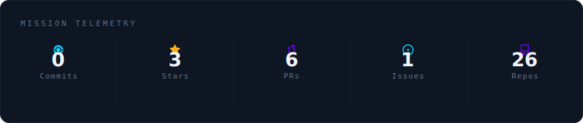

<!-- Galaxy Profile README — Eduardo Brito
     SVGs in assets/generated/ are auto-generated by the GitHub Action. -->

  

 

  

 

  

 

  

 

<strong>More about me</strong>

 

Full stack developer from Brazil.
Building web apps with TypeScript, React, Node.js and .NET.

 

  
  

